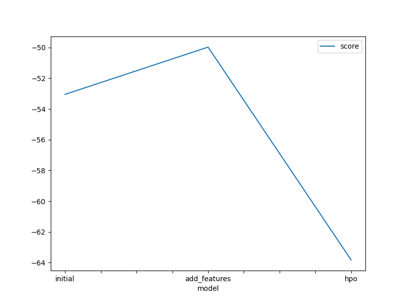
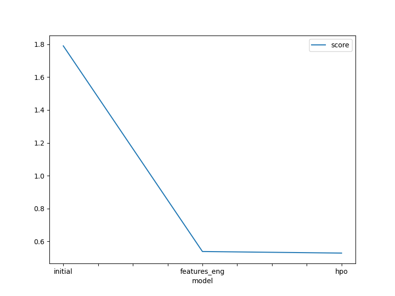

# Report: Predict Bike Sharing Demand with AutoGluon Solution
#### NAME HERE

## Initial Training
### What did you realize when you tried to submit your predictions? What changes were needed to the output of the predictor to submit your results?
TODO: The outputs are ought to be positive, we did a desctibe function description on the results, by which we noticed that our results are
all positve.

### What was the top ranked model that performed?
TODO: WeightedEnsemble_L3

## Exploratory data analysis and feature creation
### What did the exploratory analysis find and how did you add additional features?
TODO: We fixed the adte columns to a datetime data type and plotted a histogram of all features to see their dustribution
, we used the date column later to create additional features , such as hours, months and years seperately. 

### How much better did your model preform after adding additional features and why do you think that is?
TODO: It scored 0.53834, it's a 30% better.

## Hyper parameter tuning
### How much better did your model preform after trying different hyper parameters?
TODO: It scored 0.52883  which is a slight imporovment to the model.

### If you were given more time with this dataset, where do you think you would spend more time?
TODO: Yes, we could investigate more the data and the meta data that may lead us for further feature engineering, 
or it may emphysize more features to be more importnant than other feature.

### Create a table with the models you ran, the hyperparameters modified, and the kaggle score.
|model|hpo1|hpo2|hpo3|score|
|--|--|--|--|--|
|initial|default|default|GBM:'num_boost_round': 100|num_leaves'(lower=26, upper=66, default=36)	|
|add_features|default|default|NN_TORCH (num_epochs': 10)|activation('relu', 'softrelu', 'tanh')|
|hpo|default|default|searcher: 'auto'|num_trials: 5,scheduler: local|

### Create a line plot showing the top model score for the three (or more) training runs during the project.

TODO: Replace the image below with your own.

### Create a line plot showing the top kaggle score for the three (or more) prediction submissions during the project.

TODO: Replace the image below with your own.

## Summary
TODO: Auto Gluon is a powerful method that saves time and effort running algorithms in parallel with fine tunning them.
Auto ML is preferable when we have a alck of time, but it hides important details as well, such as each model nature, 
what kind of data dustribution the model accepts, as so on.

